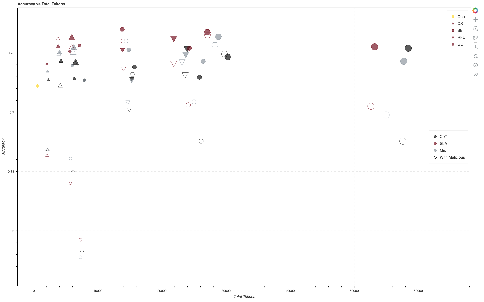

# Designing LLM-based Multi Agent System for Resilience

This repo provides a framework to simulate various agent collaboration schemas including crowdsourcing, group chat, reflection, and blackboard with the presence of malicious agents.

## Experiment Results with TruthfulQA



## Usage

### Environment Setup

```bash
python -m venv venv
source venv/bin/activate # On Windows, use: venv\Scripts\activate
pip install -r requirements.txt
```

### Setup local variables

Create .env file as follows

```bash
OPENAI_API_KEY=<YOUR_API_KEY>
LLM_MODEL=gpt-4o-mini-2024-07-18
TEMPERATURE=1
```

### Run agent collaboration framework

```bash
python scripts/run_eval.py
```
